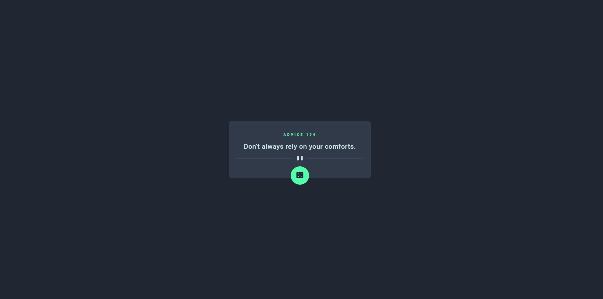
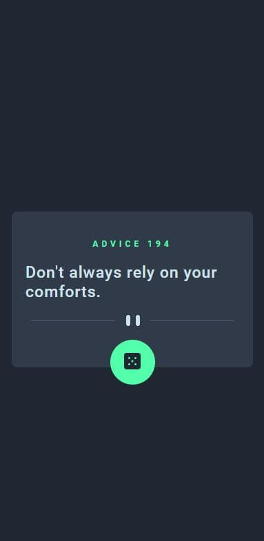

# App generadora de avisos

## Descripción general

Esta es una solución al desafío Advice generator app de Frontend Mentor

## Reto
Los usuarios deberían poder:
- Ver el diseño óptimo para la aplicación según el tamaño de pantalla de su dispositivo
- Ver estados de desplazamiento para todos los elementos interactivos en la página
- Genera un nuevo consejo haciendo clic en el ícono del dado

## Captura de pantalla

Imagen del sitio web en desktop

Imagen del sitio web en dispositivo móvil

## Links
- URL Github: https://github.com/NellyMollocondo/advice-generator-app
- URL Sitio web: https://nellymollocondo.github.io/advice-generator-app/

## Construido con
- React
- CSS
- JSX
